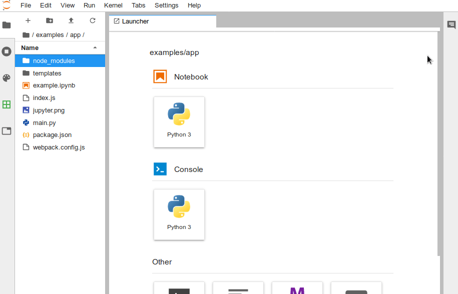
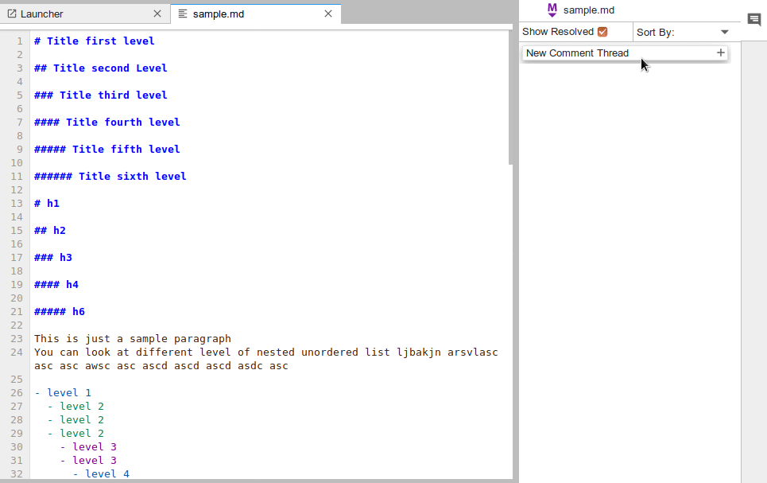
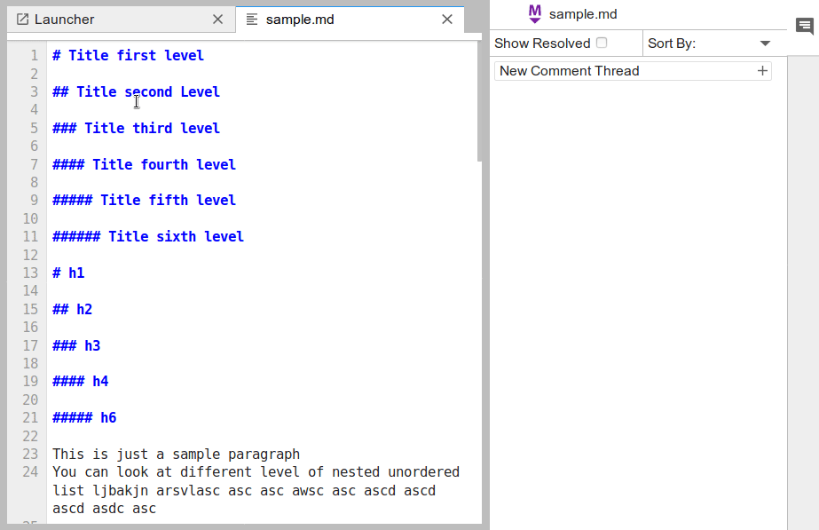
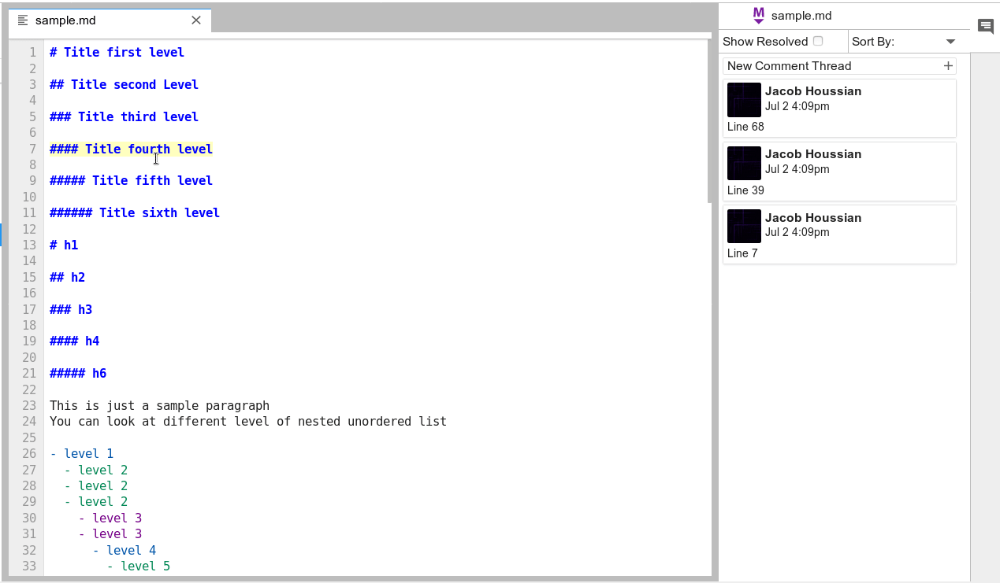

# Usage

## Overview

The commenting panel is located on the right side panel on Jupyter's main area.

When opened for the first time it will ask for you github username to know who is commenting. This uses the [public GitHub API](https://developer.github.com/v3/) to get your name and profile image.

Once logged in, you are able to do a variety of things.

---

- **[General Usage](general-usage)**
  - [Creating a comment thread](#creating-a-comment-thread)
  - [Resolving a thread](#resolving-a-thread)
  - [Edit a comment](#edit-a-comment)
  - [Deleting comments](#deleting-comments)
  - [Filtering and sorting threads](#filtering-and-sorting-threads)
- **[Commenting on text files](#commenting-on-text-files)**
  - [Entire Line](#entire-line)
  - [Specific selection](#specific-selection)
  - [Focus indicator](#focus-indicator)
- **[Where do comments save?](#where-do-comments-save)**

---

## General Usage

### Creating a comment thread

Once signed in, you can create a comment thread by clicking on `New Comment Thread`. Once the thread is created others can reply to your thread.

### Resolving a thread

Threads can be resolved by clicking on the `Resolve` button. A thread can be re-opened by clicking on the `Re-open` button.

### Edit a comment

Clicking on a comment thread will expand the conversation and enable the option to edit by hovering over a comment and clicking on the edit button.

### Deleting comments

In the same way as editing, once a thread is expanded you can delete a comment with the delete button.

### Filtering and sorting threads

By using the drop-down on the top, you can sort comment threads. The show resolved check-box can be used to filter resolved threads.

---

## Commenting on text files

To comment on a text file, you can either select exactly what you want to comment on, right click, and select the option `Create New Comment`, then go about creating the thread. Or you can just right click the line you want to comment on, and the entire line will be marked when `Create New Comment` is selected.

### Entire line

### Specific selection

### Focus indicator

To focus an indicator you can either click on the comment thread in the commenting panel, or you can click on the indicator in the text editor to focus the related thread.

#### Indicator focus

#### Thread focus

---

## Where do comments save?

Currently comments are saved in a file that is generated in the root directory of your Jupyterlab enviroment in a file called **comments.json**. This file saves all your comments and indicators. The file can be shared and others can copy it to their file tree, or if they already have a comments.json file, they can copy the contents of the new one into their existing file.
